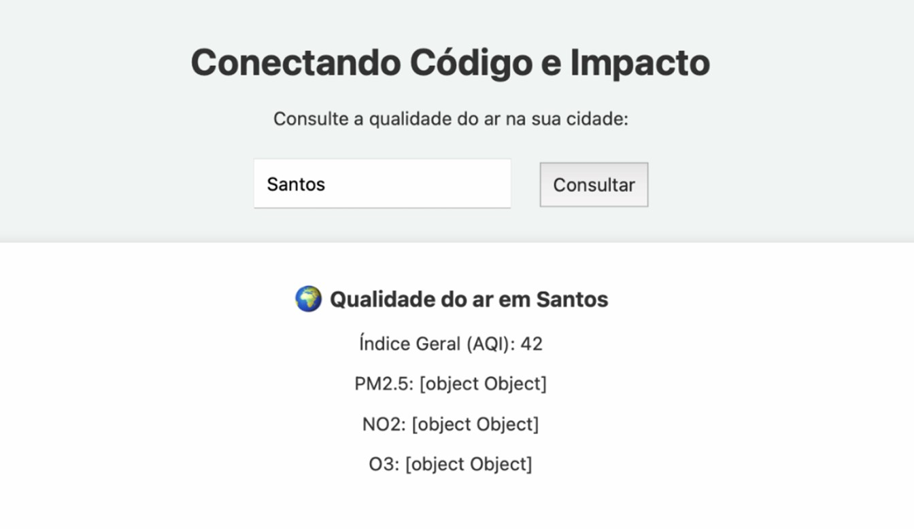

<h1 align="center"> API com Dados Ambientais </h1>

Esse é um dos projetos da Oficina Prática "Conectando Código e Impacto", conteúdo da Semana Carreira Tech da FIAP + Alura.  

  <a href="#-tecnologias">Tecnologias</a>&nbsp;&nbsp;&nbsp;|&nbsp;&nbsp;&nbsp;
  <a href="#-projeto">Projeto</a>

 

  

## 🚀 Tecnologias

Esse projeto foi desenvolvido com as seguintes tecnologias:

- HTML e CSS
- JavaScript
- Python
- Replit e API Ninjas

## 💻 Projeto

Uma página simples que consome dados reais de uma API pública sobre qualidade do ar.

Projeto original da <a href="https://carreiratech.fiap.com.br/">Fiap</a>, desenvolvido por <a href="https://www.linkedin.com/in/larissakmnakamura/">Larissa Nakamura</a>.